# 台語齒盤 電腦版使用手冊

macOS、Windows、Linux 三个平台的用法差不多仝款，無仝的所在這份手冊攏有標出來。畫面是 macOS 的；Windows 佮 Linux 的設定項目仝款。

猶未安裝，先看[按怎安裝](https://taigikeyboard.tw/#install)。

- [平台的差別](#平台的差別)
- [拍字佮選字](#拍字佮選字)
- [聲調](#聲調)
- [標點符號](#標點符號)
- [漢字佮羅馬字](#漢字佮羅馬字)
- [快速齒](#快速齒)
- [選字窗的款式](#選字窗的款式)
- [辭典佮詞庫](#辭典佮詞庫)
- [速查表](#速查表)

## 平台的差別

拍字、選字、聲調、標點的齒，三个平台攏仝款。無仝的干焦下跤這幾項。

| | macOS | Windows | Linux |
|---|---|---|---|
| 確定齒的名 | `Return` | `Enter` | `Enter` |
| 切換、拍開（設定、符號選單……） | `⌃` `⌘` ＋ 字母 | `Ctrl` `Alt` ＋ 字母 | `Ctrl` `Alt` ＋ 字母 |
| 修正當咧拍 ê 字 | `⌥` ＋ 方向齒 | `Ctrl` ＋ 方向齒 | `Ctrl` ＋ 方向齒 |
| 跳去上頭前／上尾 | `⌥` `↑` ／ `⌥` `↓` 筆電無 Home／End 齒，用 `fn` `←` ／ `fn` `→` | `Ctrl` `↑` ／ `Ctrl` `↓` `Home` ／ `End` | `Ctrl` `↑` ／ `Ctrl` `↓` `Home` ／ `End` |
| 標點換做全角／半角 | `⌃` ＋ 標點齒 | `Ctrl` ＋ 標點齒 | `Ctrl` ＋ 標點齒 |
| 暫時拍英文 | 用系統的輸入法切換 | `Shift` 揤一下，閣揤一下切轉來 | 用系統的輸入法切換 |
| 這馬的輸入狀態 | 選單列的圖示袂變；切換的時螢幕會顯示 | 工作列的圖示：台、Ts、白、Ch、方、英 | 系統匣的圖示：台、Ts、白、Ch、方 |
| 拍 `·` | `⌥` `⇧` `9`，抑是符號選單 | `Alt` ＋ 數字盤 `0183`，抑是符號選單 | 符號選單 |

macOS 的符號：`⌃` control、`⌥` option、`⌘` command、`⇧` shift。

圖示的意思：

| 圖示 | 輸入文字 | 輸出 |
|---|---|---|
| 台 | 台羅 | 漢字 |
| Ts | 台羅 | 羅馬字 |
| 白 | 白話字 | 漢字 |
| Ch | 白話字 | 羅馬字 |
| 方 | 方音符號 | |
| 英 | 英文（干焦 Windows） | |

## 拍字佮選字

1. 佇電腦的輸入法選單，揀【台語齒盤】。
2. 拍 `taigi`，選字窗就會出現。聲調免拍嘛會使。
3. 揤確定齒輸出 `台語`，揤 `Space` 輸出 `tâi-gí`。

逐个候選詞頭前的細字，是直接選彼个詞的齒。

### macOS

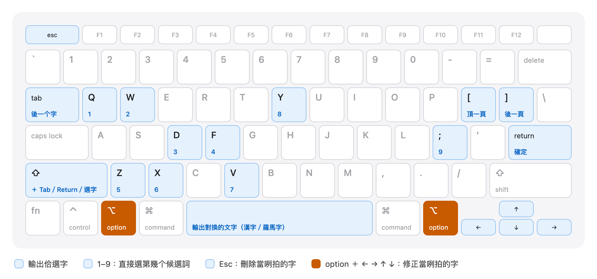

### Windows、Linux

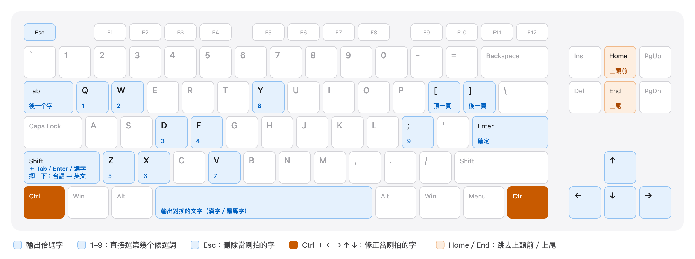

`Shift` 揤一下切換英文，干焦 Windows 有。

| 功能 | macOS | Windows、Linux |
|---|---|---|
| 確定（輸出反白的候選詞） | `Return` | `Enter` |
| 輸出對換 ê 文字（漢字／羅馬字） | `Space` | `Space` |
| 輸出當咧拍 ê 字（照拍的輸出，`taigi`） | `⇧` `Return` | `Shift` `Enter` |
| 後一个字 | `Tab` | `Tab` |
| 頂一个字 | `⇧` `Tab` | `Shift` `Tab` |
| 後一頁／頂一頁 | `]` ／ `[` | `]` ／ `[` |
| 直接選字 | `q` `w` `d` `f` `z` `x` `v` `y` `;` | 仝款 |
| 直接選字，輸出對換 ê 文字 | `⇧` ＋ 選字齒 | `Shift` ＋ 選字齒 |
| 徙動選字游標 | `←` `→` `↑` `↓` | 仝款 |
| 修正當咧拍 ê 字 | `⌥` `←` ／ `⌥` `→` | `Ctrl` `←` ／ `Ctrl` `→` |
| 跳去上頭前／上尾 | `⌥` `↑` ／ `⌥` `↓`，`fn` `←` ／ `fn` `→` | `Ctrl` `↑` ／ `Ctrl` `↓`，`Home` ／ `End` |
| 刪除當咧拍 ê 字 | `Esc` | `Esc` |

選字、輸出的齒攏會當改：設定 → 快速齒。修正當咧拍 ê 字彼幾个齒是固定的。

## 聲調

兩種拍法：設定 → 一般 → 聲調拍法。兩个平台的齒仝款。

### 數字調（預設）

字母後壁拍數字：`tai5gi2` → `tâi-gí`。數字予聲調用去，選字就用字母齒。

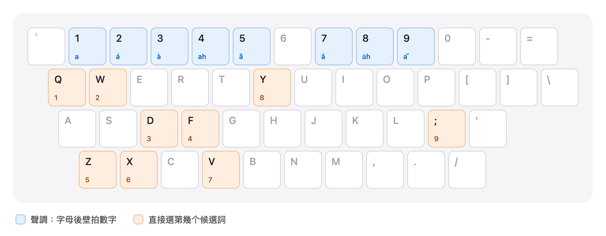

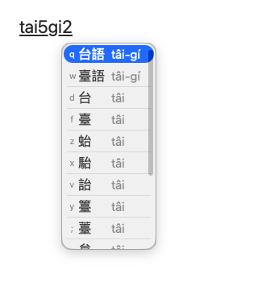

### Telex

聲調用字母拍，手免離開字母區：`taidgiv` → `tâi-gí`。字母予聲調用去，選字就用數字齒 `1`–`9`。

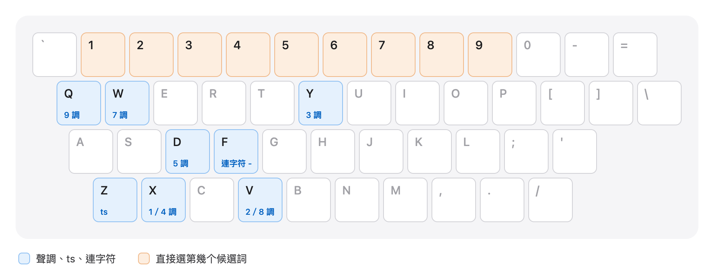

| 齒 | 意思 |
|---|---|
| `x` | 第 1 ／ 4 調 |
| `v` | 第 2 ／ 8 調 |
| `y` | 第 3 調 |
| `d` | 第 5 調 |
| `w` | 第 7 調 |
| `q` | 第 9 調 |
| `z` | ts（白話字 ch） |
| `z` `h` | tsh（白話字 chh） |
| `f` | 連字符 - |

袂記得的時，揤 `⌃` `⌘` `/`（Windows、Linux：`Ctrl` `Alt` `/`），Telex 說明會浮佇螢幕頂；閣揤一擺就收起來。

 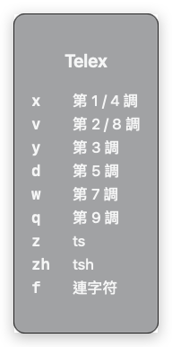

## 標點符號

漢字排頭前的時，標點自動輸出全角；羅馬字排頭前的時輸出半角。下跤的圖，藍色的字是漢字排頭前的時逐个齒輸出的標點。

### macOS

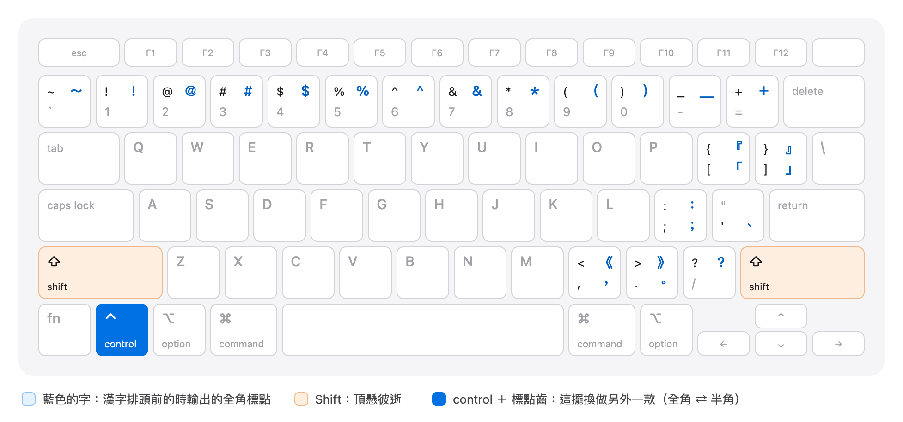

### Windows、Linux

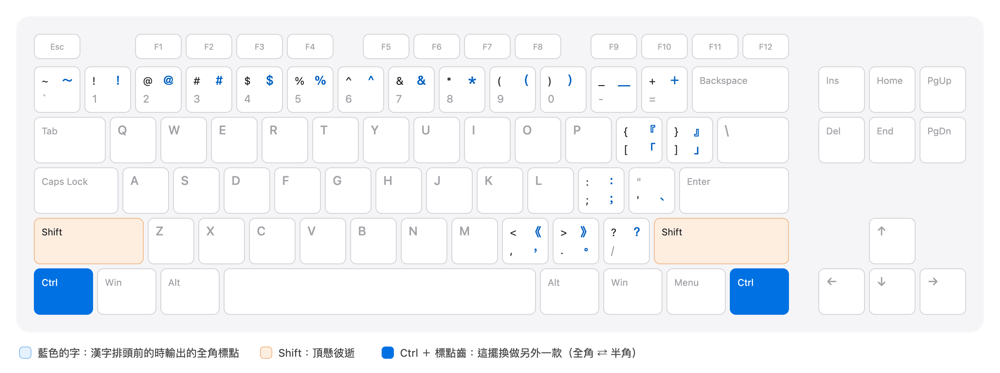

- 欲拍另外一款闊度一擺：macOS 揤 `⌃` ＋ 標點齒，Windows、Linux 揤 `Ctrl` ＋ 標點齒。親像漢字排頭前的時，`⌃` `,` 輸出半角的 `,`。`～` 無這个功能。
- 數字、`-`、`=`、`/`、`\`、`"` 攏照原來的輸出，因為數字是聲調，`-` 是連字符。
- 選字窗有佇咧的時，`[` `]` 是換頁，`;` 是選第 9 个候選詞。
- `` ` `` 是切換漢字／羅馬字的齒，袂輸出符號。

### 符號選單

齒盤頂懸無的符號，揤 `⌃` `⌘` `,`（Windows、Linux：`Ctrl` `Alt` `,`）拍開符號選單，選法佮選字仝款。較捷用的符號會排頭前。

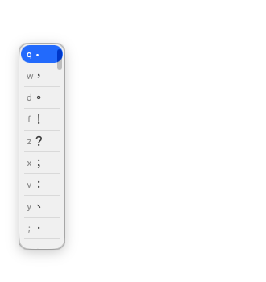

## 漢字佮羅馬字

### 佗一款排頭前

揤一下 `` ` ``，漢字佮羅馬字對換；閣揤一下換轉來。

| | 漢字排頭前（預設） | 羅馬字排頭前 |
|---|---|---|
| 確定齒 | 輸出漢字 | 輸出羅馬字 |
| `Space` | 輸出羅馬字 | 輸出漢字 |
| 標點 | 全角 | 半角 |
| |  | 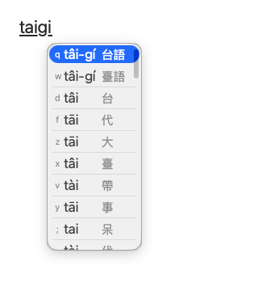 |

### 候選詞顯示

揤 `⌃` `⌘` `H`（Windows、Linux：`Ctrl` `Alt` `H`）一擺換一款，抑是佇設定 → 外觀 → 候選詞顯示揀。

| 款式 | 說明 | |
|---|---|---|
| 漢羅對應（預設） | 逐格攏有漢字佮伊的羅馬字，一格會當輸出兩款文字。 |  |
| 漢羅濫 | 漢字佮羅馬字逐个家己一格，欲用佗一个就揀佗一个。 | 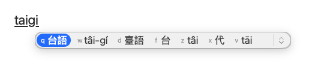 |
| 羅馬字 | 選字窗干焦顯示羅馬字。聲調無拍，伊嘛會補起來。 | 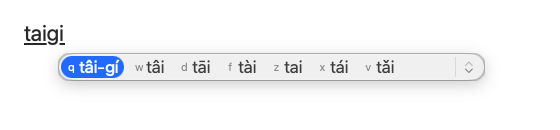 |

### 拍 ê 羅馬字囥第一格

設定 → 一般 → 拍 ê 羅馬字囥第一格。拍開了後，你拍的羅馬字排第一格，揤確定齒就照你拍的輸出。無拍開的時，`⇧` `Return`（Windows、Linux：`Shift` `Enter`）嘛會當輸出當咧拍 ê 字。

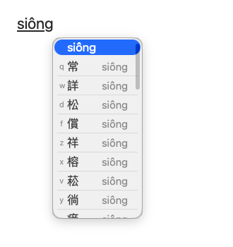

### 輸入文字

台羅、白話字、方音符號，佇設定 → 一般 → 輸入文字揀，抑是用快速齒切換。

| 功能 | macOS | Windows、Linux |
|---|---|---|
| 切換台羅／白話字 | `⌃` `⌘` `C` | `Ctrl` `Alt` `C` |
| 切換方音符號 | `⌃` `⌘` `P` | `Ctrl` `Alt` `P` |
| 拍開方音符號齒盤 | `⌃` `⌘` `J` | `Ctrl` `Alt` `J` |

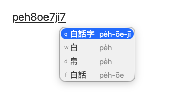

方音符號：漢字直接出現佇你拍的所在；揤 `↓` 拍開候選詞，用數字齒揀。

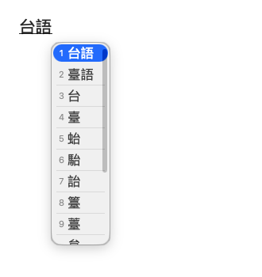

袂記得佗一个齒是佗一个符號，共方音符號齒盤拍開，用滑鼠點嘛會當拍字。

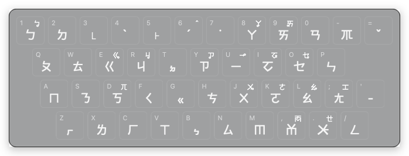

## 快速齒

切換佮拍開的功能，macOS 是 `⌃` `⌘` 加一个齒，Windows、Linux 是 `Ctrl` `Alt` 加仝一个齒。齒的位置兩爿仝款，無仝的是倒手爿下跤彼兩个齒。

### macOS

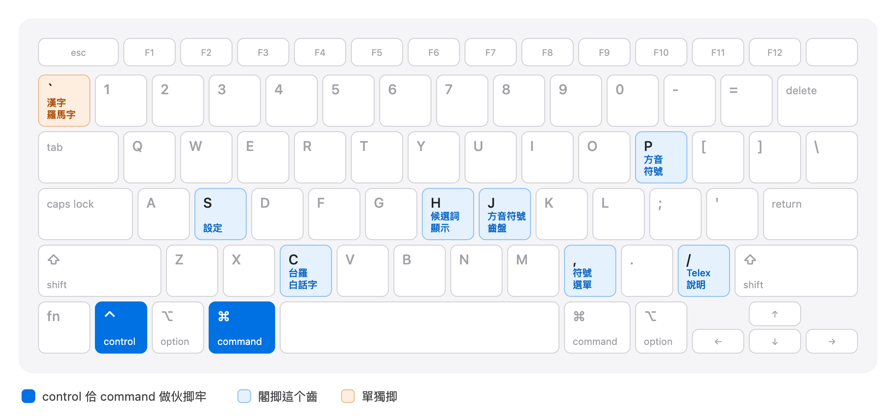

### Windows、Linux

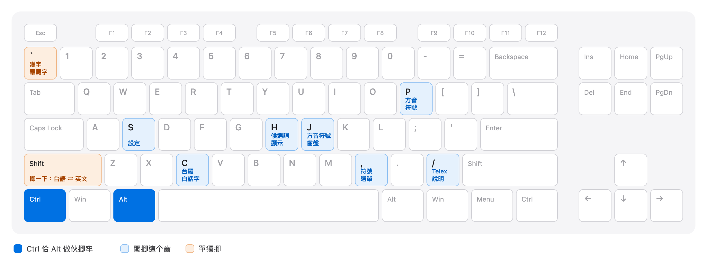

`Shift` 揤一下切換英文，干焦 Windows 有。

| 功能 | macOS | Windows、Linux |
|---|---|---|
| 切換漢字／羅馬字 | `` ` `` | `` ` `` |
| 切換候選詞顯示 | `⌃` `⌘` `H` | `Ctrl` `Alt` `H` |
| 切換台羅／白話字 | `⌃` `⌘` `C` | `Ctrl` `Alt` `C` |
| 切換方音符號 | `⌃` `⌘` `P` | `Ctrl` `Alt` `P` |
| 拍開符號選單 | `⌃` `⌘` `,` | `Ctrl` `Alt` `,` |
| 拍開 Telex 說明 | `⌃` `⌘` `/` | `Ctrl` `Alt` `/` |
| 拍開方音符號齒盤 | `⌃` `⌘` `J` | `Ctrl` `Alt` `J` |
| 拍開設定選單 | `⌃` `⌘` `S` | `Ctrl` `Alt` `S` |

### 改做家己的齒

設定 → 快速齒。

1. 點欲改的彼格。
2. 揤新的齒。若是別項功能已經咧用，舊的彼格會自動清掉。
3. 無愛用的，揤 ⓧ 清掉。

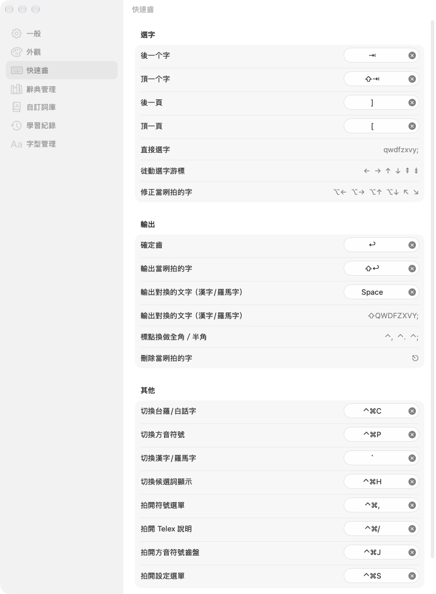

## 選字窗的款式

設定 → 外觀。

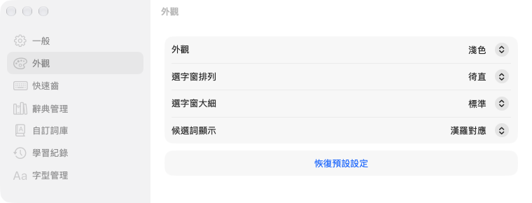

### 排列

| 徛直（預設） | 水平 | 展開 |
|---|---|---|
| 一逝一个詞。 | 橫的一排。用 `]` `[` 換頁。 | 平常時是橫的一排，揤 `↓` 就展開。 |
| 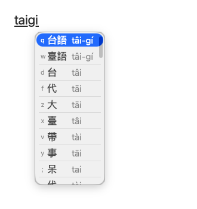 | 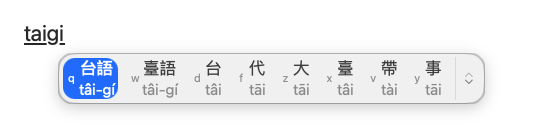 | 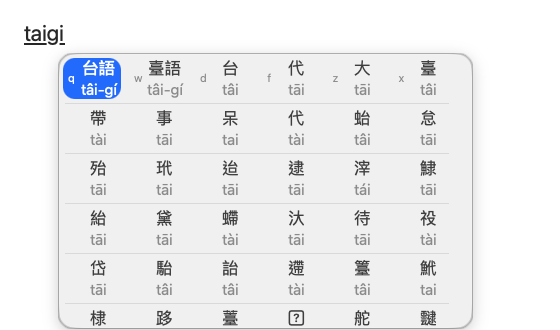 |

### 大細佮色水

五款大細：上細、細、標準、大、上大。色水有淺色、深色，抑是【自動】綴電腦換。

| 上細 | 上大 | 深色 |
|---|---|---|
| 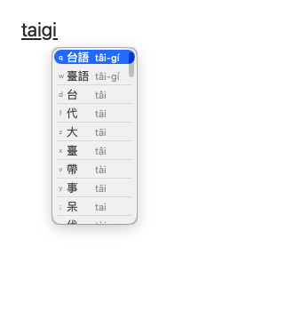 | 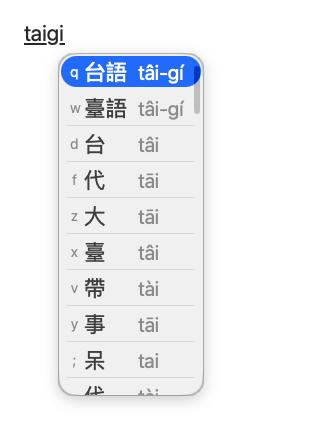 | 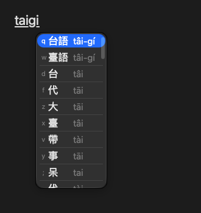 |

### 字型

設定 → 字型管理。內底有粉圓、芫荽、源樣明體、源樣烏體；嘛會當加入家己的字型。

| 粉圓 | 芫荽 | 源樣明體 |
|---|---|---|
| 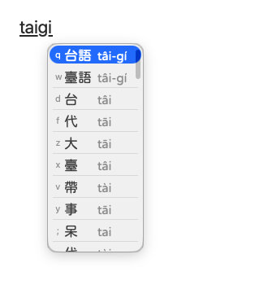 |  | 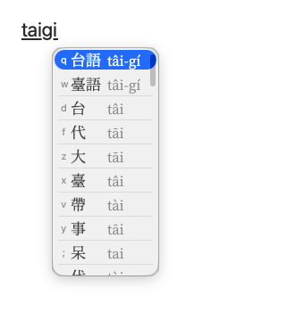 |

## 辭典佮詞庫

| 設定頁 | 用途 |
|---|---|
| 辭典管理 | 揀欲用的辭典：教育部辭典、台日大辭典、腔口差……無愛看著的候選詞，共彼本辭典關掉。 |
| 自訂詞庫 | 辭典無的詞、家己的名、專門用語，加入去就拍會出來。會當匯入、匯出。 |
| 學習紀錄 | 齒盤會記你捷揀的字。記毋著的，佇遮刪掉。資料攏佇你的電腦內底。 |

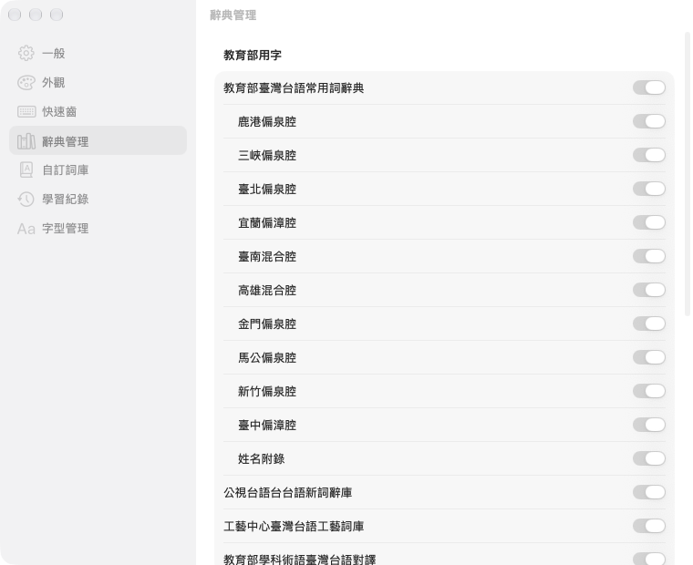

輸入文字、聲調拍法、輸出文字、無連字符、自動閬一格、介面語言，攏佇【一般】。

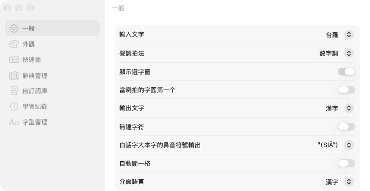

## 速查表

上捷用的齒收佇一張圖，會當印出來。

| macOS | Windows、Linux |
|---|---|
| [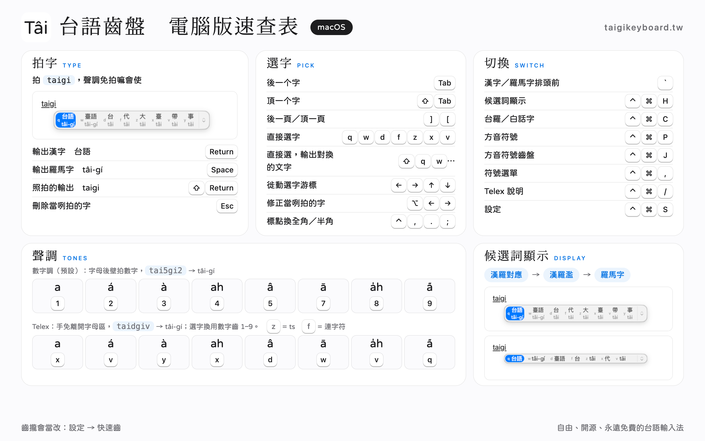](cheatsheet/taigikeyboard-desktop-macos.png) | [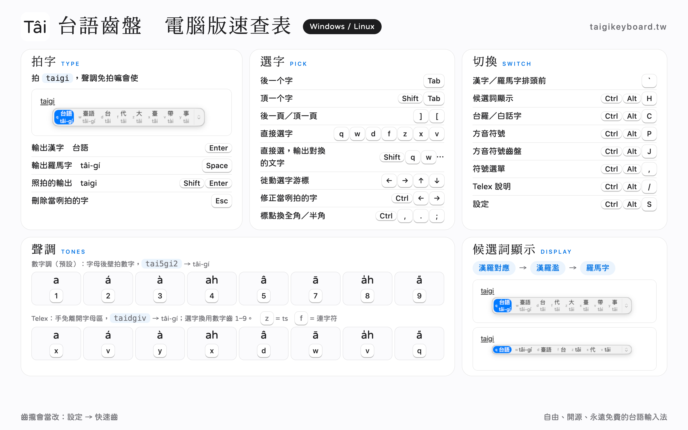](cheatsheet/taigikeyboard-desktop-windows-linux.png) |

問題佮建議：[問題回報](https://taigikeyboard.tw/#issues)。
